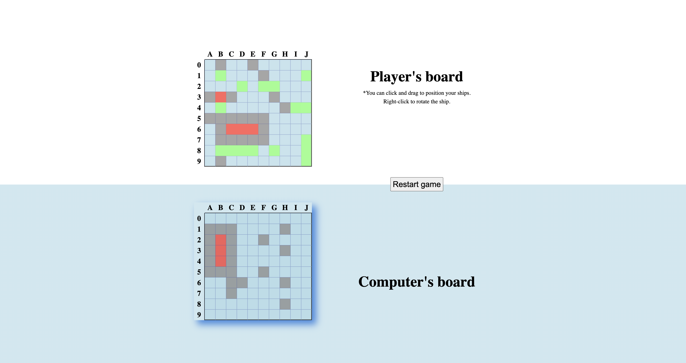
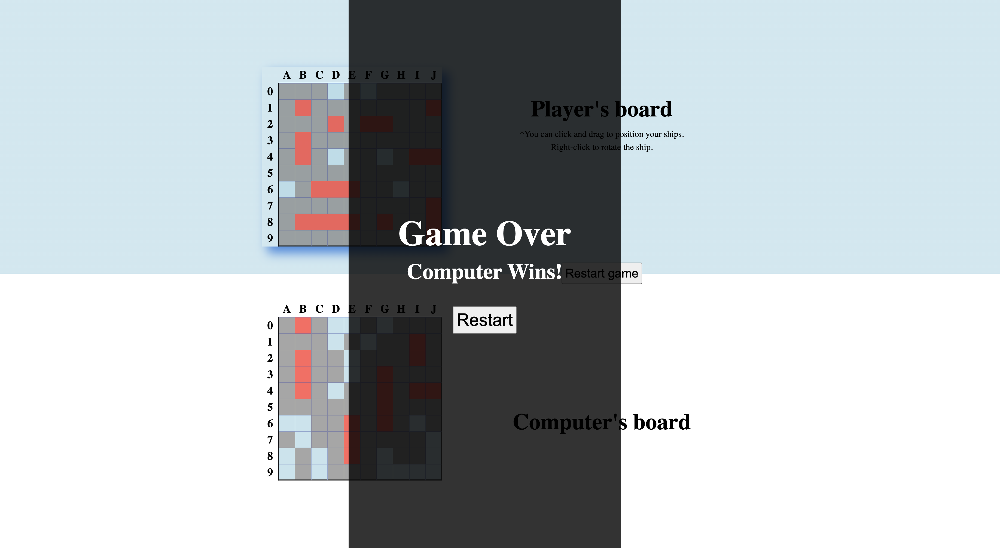

# Battleship

16th project of Odin Project. Create a battleship game using Javascript.
<<<<<<< HEAD
https://aknos2.github.io/Battleship/
=======
If a ship is destroyed, all the adjacent cells will be marked. Computer is intelligent enough to hit squares consecutively.

## Website url

https://aknos2.github.io/Battleship/

## Screenshots

## Technologies used

- Javascript
- Webpack
- Babel
- Jest
>>>>>>> 4d02895 (edit README)
